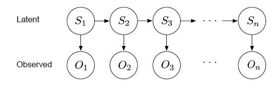

All questions in this problem set can be solved using WebPPL, which may be written and executed directly inside textboxes on this page. These textboxes save their state so you can edit them, close the window, and return again later. To submit your work, use the export button at the bottom of the page, and then upload the result to stellar.

<!-- <a id="loadBtn" style="visibility:hidden"><button style="color:black">Reload</button></a>-->

# Question 0: Example
> I show you two identical-looking coins, and tell you that one is fair (i.e. $$\mathbb{P}(\text{Heads}) = 0.5$$) while the other is biased with $$\mathbb{P}(\text{Heads}) = 0.9$$. You then toss one of the two coins and observe that it lands tails.

What is the probability that you chose the fair coin? The code has been written for you, and needs only to be uncommented. 
~~~~
var model = function() {
/*  var fair = flip()
    var p_heads = fair ? 0.5 : 0.9
    var face = flip(p_heads) ? 'H' : 'T'
    condition(face == 'T')
    return {fair: fair} */
}

var dist = Infer({method:'enumerate'}, model)
viz.auto(dist)
console.log("P(fair | tails) = ", Math.exp(dist.score({fair:true})))
~~~~

# Question 1: A Bayes Net for Exam Results

> The year is 2022 A.D. You, now a young professor at MIT, are the instructor for 9.666 (“Computational Cognitive and Molecular Neuroscience”). The class contains many industrious students, but it also has some students who you suspect are, in fact, not studying. In order to determine which students are trying to get by without studying, you decide to set weekly exams. You decide to make most (50%) of the exams easy, and the rest (20%) hard. In either case, you expect that students who study will be more likely to pass the exam than students who do not study, with roughly these probabilities:

| Studied? $$S$$  | Exam is easy? $$E$$ | Pass the exam? $$\mathbb{P}(P \mid S,E)$$ |
| :-----------:     |:----------------:   | :-------------------------:   |
| T                 | T                   | 0.9                           |
| T                 | F                   | 0.4                           |
| F                 | T                   | 0.6                           |
| F                 | F                   | 0.2                           |

> A priori, at the time you set up the exams but before looking at any students scores, your best guess is that 50% of the students are studying. Your class has $$m$$ students and $$n$$ exams. You may assume that each student has constant study habits – either studying or not studying – for the entire semester. Thus, you need to represent $$i = 1 \ldots m$$ study habits $$S_i$$ and $$j = 1 \ldots n$$ exam difficulties $$E_j$$.

**(a)**
Based on the information provided above, construct a model to reason about $$m$$ students and $$n$$ exams, for arbitrary $$m$$ and $$n$$. In the [probmods textbook](https://probmods.org/v2/chapters/04-patterns-of-inference.html#example-trait-attribution) you will find a WebPPL model of a similar setup. You are free to copy/modify this code in this problem set.

What is the probability that somebody who passed an exam also studied?
~~~~
~~~~

What is the probability that an exam passed by a student who studied was hard?
~~~~
~~~~

**(b)**
Use the model constructed in (a) for the rest of the parts of this question. Student 1 fails exam 1 and 2. What is the probability that he is a studier
$$\mathbb{P}(\text{S1 studies} \mid \text{S1 failed E1 and E2})$$? What is the probability that exam 1 is easy
$$\mathbb{P}(\text{E1 is easy} | \text{S1 failed E1 and E2})$$?
~~~~
~~~~

**(c)**
You now learn that in addition to student 1 failing exams 1 and 2, students 2 and 3 failed exams 1 and 2 as well. What is the new probability that student 1 is a studier? The new probability that exam 1 is easy?
~~~~
~~~~

Explain why the changes you see go in the direction they do.

<textarea class="textAnswer" rows="8" cols="50"></textarea> 

**(d)**
In addition to knowing how all the students did on exams 1 and 2, you now find out that students 2 and 3 failed exams 3 and 4 as well. How does this change the probability that exam 1 is easy? How does it change the probability that student 1 is a studier?
~~~~
~~~~

Explain why you observe the changes that you do.

<textarea class="textAnswer" rows="8" cols="50"></textarea> 

**(e)**
To complete the performance record of all the students, you find out that student 1 has passed exam 3 and 4. Given this complete record, what are the new probabilities that exam 1 is easy and that student 1 is a studier?
~~~~
~~~~
Do they change significantly from your answer in part (d)? Why or why not?

<textarea class="textAnswer" rows="8" cols="50"></textarea> 

**(f)** Find a friend and describe the situation in this problem (3 students, 4 exams, 50% likelihood of studying and 50% easy exams, and the probabilities given in the table above). For each of parts (b) through (e), ask for their intuitive judgments about how the changes made would alter the probability that student 1 is a studier and that exam 1 is hard. To make it easier for your subject to give consistent judgments, you should first ask them about the direction of change that they expect for each probability (up, down or no change) after each piece of information, and then ask them to give their best numerical guess for that probability.

Record your subject's answers for each of parts (b)–(e). Compare these answers to the performance of your Bayesian network model, both qualitatively (do the judgments shift in the right direction?) and quantitatively (how close are the numerical judgments to the correct probabilities?). If there are there any differences, can you identify any general trends or patterns? Why do you think you see those differences? Do your own gut instincts look similar to your subjects judgments?

<textarea class="textAnswer" rows="8" cols="50"></textarea> 

**(g)**
For this question, you can use the WebPPL editor below as scratch space but do not need to submit your code.

~~~~
~~~~

Redo parts (b)–(e) using a different value for the prior probability of an exam being easy and the prior probability of a student being a studier, and submit the results. (Find a prior that does have at least some effect.) What role do these priors have on the assessments of student A and exam 1? In general, does changing the priors result in a qualitative or simply a quantitative shift in the output of the Bayes net? In particular, consider the explaining away effect that occurs between (b) and (c) for the probability that student 1 is a studier. How does this effect depend on the prior probabilities, and why?

<textarea class="textAnswer" rows="8" cols="50"></textarea> 

**(h)**
Now we’re going to put priors on our priors. 

Assume that the professor (you) is either a lenient instructor or a challenging instructor. An instructor is equally likely to be lenient or challenging, and stays that way throughout the course. Let $$\mathbb{P}(\text{Exam is easy} \mid \text{Lenient}) = 90\% $$ and $$\mathbb{P}(\text{Exam is easy} \mid \text{Challenging}) = 20\% $$. Assume that the class is either advanced or introductory, and is a priori equally likely to be either. Let $$\mathbb{P}(\text{A student studies} \mid \text{Advanced class}) = 95\%$$ and $$\mathbb{P}(\text{A student studies} \mid \text{Introductory class}) = 60\%$$.

Repeat the inferences in parts (b)–(e), but this time calculate the posterior distribution over whether the instructor is challenging/lenient and advanced/introductory.

~~~~
~~~~

Explain the qualitative shifts between these posteriors in (b)–(e): concretely, a trend in parts (b)–(d) is reversed in part (e). What and why is this trend, and why is it reversed?

<textarea class="textAnswer" rows="8" cols="50"></textarea>

*Note: You can take out these “priors on priors” for the next part.*

**(i)**
The assumptions we made when setting up the models in this question are highly oversimplified. For example, it might be more accurate to say that students either study a lot, study a little, or don’t study; we could even model students’ study habits as continuous variables. The models are also unsuitable for certain questions that we might wish to ask them; we might want to be able to infer, say, which students studied together, or whether a given student was sleepy while taking the test.

Devise an a small extension of these models which better reflects your intuitive understanding of this domain, and modify your WebPPL code to implement it (you’ll probably need to expand the probability tables given above as you add more random variables; just choose values that seem reasonable). Test your new model by querying it with a few representative questions (e.g. did students 1 and 2 study together?).

~~~~
~~~~

Does your intuition match the model predictions? Why do you think your new model does or does not capture your own judgments?

<textarea class="textAnswer" rows="8" cols="50"></textarea> 

# Question 2: The Casino Dealer Switching Game

> You enter a casino and walk up to a new game table. A suspicious looking dealer flips coins and participants predict whether the coin will land heads or tails. Observing many other players lose their money to the dealer, you notice a strange pattern in the coin flips. You suspect the dealer might be switching between two types of coins. You decide to use your probabilistic modeling skills to predict the next flip and beat the house for the first time.

To model the stochastic process according to which the dealer operates, you initially assume that there’s a fixed probability pswitch that on any given trial, the dealer will switch coins. You make the ‘Markov assumption’ that the dealer’s choice of coin at state k depends only on the coin used at the previous state, k−1, and the fixed probability pswitch. The probabilistic model where the current state of the world depends only on some previous latent state is called a Hidden Markov Model (HMM), since the outcome at the current state only depends on the previous state (Markov) which happens to be latent (or “hidden”). HMMs are widely used in computational biology (e.g. for gene recognition and alignment) and computational linguistics (e.g. for speech recognition and segmentation).

*Figure 1: Graphical model representation of the casino dealer switching game.*

| Switching Probabilities                         | Coin Weights                                                     |
| :---------------------------------------------: | :--------------------------------------------------------------: |
| Coin 1 → Coin 2: $$p_{1 \rightarrow 2} = 0.15$$  | $$\theta_1 = \mathbb{P}(\text{Heads} \mid \text{Coin 1}) = 0.3$$ |
| Coin 2 → Coin 1: $$p_{2 \rightarrow 1} = 0.15$$  | $$\theta_2 = \mathbb{P}(\text{Heads} \mid \text{Coin 2}) = 0.7$$ |

*Table 1: Switching probabilities and dealer’s coin weights.*

**(a)**
Write this in WebPPL

~~~~
var model = function(observations) {
  var initial_coin_dist = Discrete({ps:[0.5, 0.5]})
  var coins = [
    {next_dist: Discrete({ps:[0.85, 0.15]}), face_dist: Discrete({ps:[0.7, 0.3]})},
    {next_dist: Discrete({ps:[0.15, 0.85]}), face_dist: Discrete({ps:[0.3, 0.7]})}
  ]

  var initial_coin = sample(initial_coin_dist)
  var continue_chain = function(chain) {
    if(chain.length == observations.length) {
      return chain
    } else {
      var last_coin = last(chain)
      var next_coin = sample(coins[last_coin].next_dist)
      return continue_chain(chain.concat(next_coin))
    }
  }
  
  
  var chain = continue_chain([initial_coin])
  map2(function(coin, obs) {
     factor(coins[coin].face_dist.score(obs))
  }, chain, observations)
  return chain
}
var obs = [1, 1, 1, 0, 0, 0, 0, 0, 0, 1, 1, 1, 0, 1, 1, 1, 0, 1, 1, 0, 0, 1, 0, 0, 1, 0, 0, 1, 1, 1, 0, 0]
var dist = Infer({method:"MCMC", samples:100, burn:100, lag:100, justSample:true}, function() {return model(obs)})
var getMarginal = function(i) {return listMean(map(function(sample) {sample.value[i]}, dist.samples))}
viz.foo(_.range(obs.length), map(getMarginal, _.range(obs.length)), obs)
~~~~

<table>
<tr><td><a id="exportBtn"><button style="color:black">Export</button></a></td>
<td>Import: <input type="file" id="files" name="files[]" /></td></tr></table>

