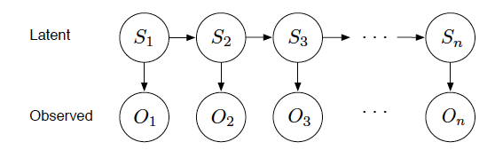

<script type="text/javascript">autosaveTo = "pset3"</script>
**Due Wednesday, Oct 30 at 11:59 pm**

<div id="autosaveTxt" style="font-style:italic"></div>

# Question 1: Preliminaries
> You and your friend are playing a game. You roll a dice repeatedly, and count up the sum of the rolls until it reaches *at least* 10. This sum then becomes your score (between 10 and 15).

How can we write out a generative model for this process? Probabilistic programming allows us to create models of structures, such as sequences or trees, by building them up with a recursive function:
~~~~
var fairDice = Categorical({vs: [1, 2, 3, 4, 5, 6], ps: [1/6, 1/6, 1/6, 1/6, 1/6, 1/6]})
var generateFrom = function(sequenceSoFar) {
  var roll = sample(fairDice)
  var sequence = sequenceSoFar.concat(roll)
  if(sum(sequence) >= 10) {
    return sequence
  } else {
    return generateFrom(sequence)
  }
}
editor.put("generateFrom", generateFrom)

var sequence = generateFrom([]) // [] is an empty list
print("Sequence: " + sequence)

var score = sum(sequence)
print("Score: " + score)
~~~~

**(a)** What is the distribution for your final score in this game?
~~~~
var generateFrom = editor.get("generateFrom")
var model = function() {
  // Your code here
}
viz(Infer({method:'enumerate'}, model))
~~~~

**(b)** What is the distribution on the total number of times you roll the dice.

*Hint: you can make use of the javascript property `length`*
~~~~
~~~~

**(c)** What is the distribution of the value of your final roll, given that your score is at least 13?
~~~~
~~~~

# Question 2: The Casino Dealer Switching Game

> You enter a casino and walk up to a new game table. A suspicious looking dealer flips coins and participants predict whether the coin will land heads or tails. Observing many other players lose their money to the dealer, you notice a strange pattern in the coin flips. You suspect the dealer might be switching between two types of coins. You decide to use your probabilistic modeling skills to predict the next flip and beat the house for the first time.

To model the stochastic process according to which the dealer operates, you initially assume that there’s a fixed probability $$p_{switch}$$ that on any given trial, the dealer will switch coins. You make the ‘Markov assumption’ that the dealer’s choice of coin at state t depends only on the coin used at the previous state, t−1, and the fixed probability $$p_{switch}$$. The probabilistic model where the current state of the world depends only on some previous latent state is called a Hidden Markov Model (HMM), since the outcome at the current state only depends on the previous state (Markov) which happens to be latent (or “hidden”). HMMs are widely used in computational biology (e.g. for gene recognition and alignment) and computational linguistics (e.g. for speech recognition and segmentation).



*Figure 1: Graphical model representation of the casino dealer switching game.*

| Switching Probabilities                         | Coin Weights                                                     |
| :---------------------------------------------: | :--------------------------------------------------------------: |
| Coin 1 → Coin 2: $$p_{1 \rightarrow 2} = 0.15$$  | $$\theta_1 = \mathbb{P}(\text{Heads} \mid \text{Coin 1}) = 0.3$$ |
| Coin 2 → Coin 1: $$p_{2 \rightarrow 1} = 0.15$$  | $$\theta_2 = \mathbb{P}(\text{Heads} \mid \text{Coin 2}) = 0.7$$ |

*Table 1: Switching probabilities and dealer’s coin weights.*

**(a)** Write WebPPL code to sample from this generative process, given some number `n` of coin faces. Your code should sample both the dealer's choice of coin and the face each flip lands on.

*Hint: Your recursive function needs to output both the sequence of coins and the sequence of faces. One way to do this is to return a two element list `[coins, faces]`. Another way is to return an javascript object `{coins:coins, faces:faces}`, where the two elements can then be referenced using `x.coins` and `x.faces`.*

~~~~
var n = 32
// Your code here

print("Coins: " + coins) // Print the dealer's coin choices, as a list of length n
print("Faces: " + faces) // Print the list of coin faces, as a list of length n
~~~~

**(b)** Suppose we observe the following sequence of coin faces:

`H H H H T H H T`

We are interested in inferring which coin was used for each flip. Using the code you wrote above, use WebPPL to infer the dealer's chosen sequence of coins, conditioned on this sequence of observations. You can use the function `viz.casino` to visualise the marginals of this distribution.

*Hint: WebPPL includes the [lodash](https://lodash.com/) library. When conditioning, you may find the function ```_.isEqual(list1, list2)``` useful to check equality of two lists.*

~~~~
var observations = ['H', 'H', 'H', 'H', 'T', 'H', 'H', 'T']
var model = function() {
  // Your code here
  return coins
}
var dist = Infer({method:"enumerate"}, model)
viz.casino(observations, dist)
~~~~

**(c)** Now try copying your code into the box below, to run inference on a longer sequence of observations.

~~~~
var observations = ['H', 'H', 'H', 'H', 'H', 'T', 'T', 'T', 'T', 'H', 'T', 'H', 'H', 'H', 'H']
// Your code here
~~~~

You will find that, on this longer sequence, the inference algorithm takes an unreasonably long time to output the posterior distribution. So far, all our calls to `Infer` have used `{method:"enumerate"}`, which calculates exact posterior probabilities by summing over all sequences of random choices that could have been made. For sequences like the one above, this means summing over all $$2^{30}$$ possibilities.

In such situations, WebPPL has a variety of [inbuilt approximate inference algorithms](http://webppl.readthedocs.io/en/master/inference/index.html), which involve sampling latent variables rather than enumerating over all possibilities. One such algorithm is Metropolis-Hastings, which Josh has covered in class.

Modify the code above so that `Infer` uses MCMC for inference, using 50000 samples. This should be able to generate an approximate posterior within in a few seconds. If you like, you can visualise MCMC progress by adding the Infer option ```callbacks: [editor.MCMCProgress()]```.

**(d)** When running the code above, you probably see a warning:

`Initialization warning [1/4]: Trace not initialized after 1000 attempts.`

This is because in order to initialise the search, Metropolis-Hastings has to find at a setting for the random choices which has non-zero posterior probability. It attempts this by sampling from the prior until it lands on a state which satisfies all of the conditions (i.e. until it happens to sample the correct sequence of coin faces). For sequences much longer than the one above, Metropolis-Hastings will fail to initialise.

We can rewrite the model above to fix this problem. Rather than sampling a face solely to condition it to equal some particular value, we can use the `observe` keyword to directly add each $$\mathbb{P}(\text{observed face} \mid \text{coin})$$ as a likelihood factor. `observe` is descibed in the [probmods textbook](https://probmods.org/chapters/conditioning.html#conditions-and-observations).

In the codebox below, rewrite your model so that inference behaves well with even longer sequences. Instead of sampling faces, your recursive function should output only a sequence of coins and call `observe` once for each coin it samples. *Hint: you may want to use either a [Bernoulli Distribution](http://docs.webppl.org/en/master/distributions.html#Bernoulli) or a [Categorical Distribution](http://docs.webppl.org/en/master/distributions.html#Categorical) for your observations*.

~~~~
var observations = ['H', 'H', 'H', 'T', 'T', 'T', 'T', 'T', 'T', 'H', 'H', 'H', 'T', 'H', 'H', 'H',
                    'T', 'H', 'H', 'T', 'T', 'H', 'T', 'T', 'H', 'T', 'T', 'H', 'H', 'H', 'T', 'T']
// Your code here
~~~~

# Question 3: Testing and fitting the model to human data

In this question we will vary the parameters of your model, and compare its predictions to human data. If you like, it might help to add a wrapper to the model above that lets you reuse the same code for different observations or parameters. You can use the box below to do this, and check that it works by repeating the inference in 2d (you should get approximately the same posterior).

~~~~
var makeModel = function(pSwitch_12, pSwitch_21, pHeads_1, pHeads_2, observations) { return function() {
    // Your model code here, using
    // pSwitch_12, pSwitch_21, pHeads_1, pHeads_2, observations

    return coins
}}
editor.put("makeModel", makeModel)

// Usage example:
var obss = ['H', 'H', 'H', 'T', 'T', 'T', 'T', 'T', 'T', 'H', 'H', 'H', 'T', 'H', 'H', 'H',
            'T', 'H', 'H', 'T', 'T', 'H', 'T', 'T', 'H', 'T', 'T', 'H', 'H', 'H', 'T', 'T']
var model = makeModel(0.15, 0.15, 0.3, 0.7, obss)
// Your Infer code here
~~~~

**(a)** *(i)*
Use 2(a) to sample a sequence of faces from a model with parameter settings in Table 1 (you may also use the sequence above, or a shorter subsequence if you were unable to complete 2d). We’ll call the model that uses the settings from Table 1 the "generating model", since it is the model according to which sequences were produced. Now use a different model — the "parsing model" — for inference (to ‘parse’ the sequence), where the switching probabilities and coin weights are different than Table 1. First, keep $$p_{switch}$$ of the parsing model the same as the generating model, but vary the coin weights. Second, keep the coin weights the same as the generating model, but vary $$p_{switch}$$ in the parsing model. What happens in these two scenarios? Describe how differences between the switching probabilities and coin weights of the generating versus parsing model affect the inferences you get, and the errors made by the model.

~~~~
var makeModel = editor.get("makeModel")
// Your code here
~~~~

<textarea class="textAnswer" rows="10" cols="80" maxlength="800"></textarea>
<div class="maxchars">(max 800 characters)</div>
<br/>

*(ii)*
People are good at detecting patterns in data, despite noise and sparse observations. However, our strong inference abilities sometimes lead us to see spurious patterns, produced by a random underlying process. In machine learning and statistics, methods that exhibit this behavior are said to be overfitting the data. Use several randomly generated sequences — where flips are generated independently from a fair coin — to test whether your model tends to overfit and find structures that aren’t really there in the data. Vary the coin switching probabilities and the coin weights. How do these different settings affect the errors the model might make in inferring the true underlying latent states? Show example sequences and the model posterior marginals to support your arguments.

~~~~
var makeModel = editor.get("makeModel")
// Your code here
~~~~

<textarea class="textAnswer" rows="10" cols="80" maxlength="800"></textarea>
<div class="maxchars">(max 800 characters)</div>
<br/>

**(b)**
Compare your posterior marginals with the human data. Sample a set of two sequences from a model with parameters as in Table 1, and ask five or more human subjects to infer the coins used to produce these sequences, using the following cover story. You may collaborate with your classmates to reduce the burden of data gathering. However, each person must gather data from at least one subject.

> You enter a casino and walk up to a new game table run by a suspicious looking dealer. The dealer flips coins and participants predict whether the coin will land heads or tails. After observing many other players lose their money to the dealer, you notice a strange pattern in the coin flips. You suspect that the dealer might be secretly switching between two types of coins, one which is biased towards tails (Coin 1, 3 out of 10 flips are heads), and one which is biased towards heads (Coin 2, 7 out of 10 flips are heads), but that dealer only switches between the two coins rarely, so as not to make the switching conspicuous.

> You confront the dealer, and she admits to using two different coins, as you suspected. She challenges you to predict what coin was used to produce each coin flip in a sequence of coin flips. If you perform this task successfully, you will win back all the money lost to the house in the game. For each coin flip, please mark whether you think it was produced by Coin 1 or Coin 2.

Show a plot of human data against your model’s predictions, produced with the same settings of the coin weights and $$p_{switch} = 0.15$$. How does the model fit the subjects' responses?

To compare your model predictions directly to a subjects' ratings, plot your model posterior against the mean of the ratings. Does it make sense to compare the model to the a single subject or to the averaged subject ratings?

~~~~
var makeModel = editor.get("makeModel")

// Your code here. You can use viz.casino to plot the mean subject ratings. For example:
// var obss = ['H', 'H', 'H', 'H', 'T', 'T']
// var p_coin1 = [0.2, 0.2, 0.3, 0.4, 0.6, 0.8]
// viz.casino(obss, p_coin1)
~~~~

<textarea class="textAnswer" rows="12" cols="80" maxlength="1000"></textarea>
<div class="maxchars">(max 1000 characters)</div>
<br/>

**(c)**
Even for an ideal Bayesian agent who knows the parameters of the generating model, the coin weights and the switching probabilities, the difficulty of this parsing task depends on how those parameters are set. Consider different settings of the generating model parameters, and test how well the Bayesian ideal learner does at parsing (inferring the correct generating coin sequences) for several different sequences drawn from the model at each parameter setting.

~~~~
var makeModel = editor.get("makeModel")
//Your code here
~~~~

*(i)*
Which parameter settings are intrinsically harder or easier? Why?

<textarea class="textAnswer" rows="8" cols="80" maxlength="600"></textarea>
<div class="maxchars">(max 600 characters)</div>
<br/>

*(ii)*
Try out your own intuitions on similar example sequences where you know the correct parameter values for the generating model but do not know (i.e., hide from yourself) the true coins used at each step of the sequence. Qualitatively, do the same parameter changes which affect difficulty for the model also affect difficulty for you? Are there sequences that are systematically difficult for you, easy for the model, or vice versa? Give some examples of sequences and the inferences you and the model made to support your claims.

<textarea class="textAnswer" rows="10" cols="80" maxlength="800"></textarea>
<div class="maxchars">(max 800 characters)</div>
<br/>


**(d)**
Is the Hidden Markov Model (HMM) approach a good way to model the way people approach this task? What are some ways of generating sequencing of flips where this approach will get the wrong answer? And what general changes would you make to the model to try to correct the model?

<textarea class="textAnswer" rows="7" cols="80" maxlength="500"></textarea>
<div class="maxchars">(max 500 characters)</div>
<br/>


<div style="background:#65b7bf33; padding:10px">
<h4><b>PSET 3 Feedback (optional)</b></h4>
<textarea class="textAnswer" rows="7" cols="80"></textarea>
</div>

<hr/>

<b>Before submission please make sure all of the figures you want to include are visible above.</b><br/>
If not, you can use the 'Run All' button below to re-run all of your code.<br/>

To submit your work, click the export button and then upload the result to stellar. <i>Note: If you get a ‘Download Failed’ error, you can also copy+paste the textbox that appears underneath into a text file</i>
<table>
<tr>
<td>
<a id="runBtn"><button style="color:black">Run All</button></a>
<a id="exportBtn"><button style="color:black">Export</button></a>
</td>
<td>Import: <input type="file" id="files" name="files[]" /></td></tr></table>

<br/><br/><br/><br/><br/><br/>

<hr/>


<h3>Final Project Idea (Optional)</h3>

Using a larger scale method of testing human subjects (like Amazon’s Mechanical Turk: https://www.mturk.com), test 10 or more subjects in the above task, using the two conditions (one where the coin weights are .5 and .8 but the switching probability is low (.2), and one where the coin weights are .5 and .6, but the switching probability is high (.7)).

To make the study more convincing, write a function to sample sequences of flips from the model given certain configurations of the coin weights and pswitch (keeping track of which latent state produced these). Each subject in a condition will receive a random sample of flips from that condition.

Write a function to sample sequences of flips from an interestingly different generative process. Think of a generative process where human subjects can do well on the task, but where the HMM approach fails.
To quantify the error of the sampler, you can use the measure of mean error, in one of at least two ways:

- Using the sampler's estimate of posterior marginals. Let
      $$E_{PM}$$ be the mean error of the posterior marginals
      compared with the true underlying set of latent states. Let
      $$\tilde{S_{i}}$$ be the posterior marginal of state $$S_{i}$$,
      estimated by the sampler. Then the $$E_{PM}$$ is:

$$ E_{PM} = \left|[\tilde{S_{1}}\ \tilde{S_{2}}\ \cdots\
          \tilde{S_{n}}] - [S_{1}\ S_{2}\ \cdots\ S_{n}]\right| $$

where each $$S_{i}$$ is the true setting of the latent
      state used to produced the sequence.

- Using the sampler's maximum a posterior (MAP)
      estimate. Rather than using the posterior marginals, the mean
      error will be computed using the sampled configuration of the
      latent states that received the single best score under the
      posterior. $$E_{\text{MAP}}$$, the mean error
        of the MAP, is:

$$\text{argmax}_{\mathbf{S}}P$$

$$\text{argmax}_{\mathbf{S}}P(\mathbf{S} \mid O_1, \ldots, O_n)$$

$$E_{\text{MAP}} = \left|\mathbf{S}_{best} - [ S_1, S_2, \ldots, S_n ] \right| $$

Similarly, the error of the human subjects can simply be the mean error using the aver- age subject ratings, appropriately transformed. Show plots comparing the performance of the model with humans, using one or both of these measures.
